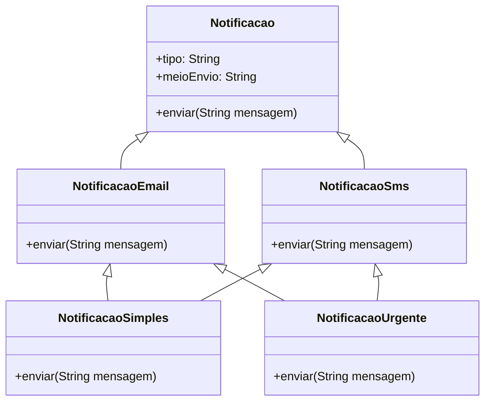
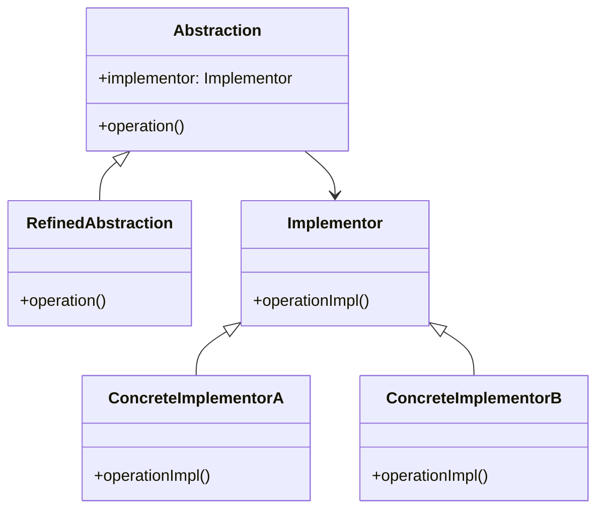
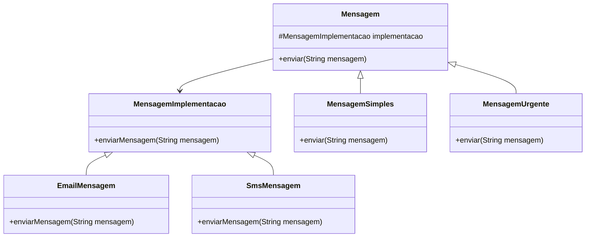

# Bridge Padrão: Separando Abstração da Implementação

## Intenção do Padrão
O padrão **Bridge** tem como objetivo desacoplar uma abstração de sua implementação, permitindo que ambos evoluam independentemente. Isso facilita a manutenção, reutilização de código e aumenta a flexibilidade do sistema.

## Motivação
Em muitos casos, sistemas precisam oferecer múltiplas variações de um mesmo conceito. Por exemplo, em um sistema de notificações, podemos ter diferentes tipos de mensagens (simples, urgentes) e diferentes meios de envio (e-mail, SMS). Se essas variações forem implementadas diretamente em subclasses, o código pode se tornar rígido e difícil de expandir. O padrão **Bridge** resolve esse problema separando a abstração da implementação, permitindo combinações flexíveis.

## Código Antes da Aplicação do Bridge

```java
package semBridge;

class NotificacaoEmailSimples {
    public void enviar(String mensagem) {
        System.out.println("Enviando E-mail: " + mensagem);
    }
}

class NotificacaoEmailUrgente {
    public void enviar(String mensagem) {
        System.out.println("*** URGENTE *** Enviando E-mail: " + mensagem);
    }
}

class NotificacaoSmsSimples {
    public void enviar(String mensagem) {
        System.out.println("Enviando SMS: " + mensagem);
    }
}

class NotificacaoSmsUrgente {
    public void enviar(String mensagem) {
        System.out.println("*** URGENTE *** Enviando SMS: " + mensagem);
    }
}

public class Main {
    public static void main(String[] args) {
        NotificacaoEmailSimples emailSimples = new NotificacaoEmailSimples();
        emailSimples.enviar("Olá, este é um teste de e-mail.");

        NotificacaoSmsUrgente smsUrgente = new NotificacaoSmsUrgente();
        smsUrgente.enviar("Este é um alerta crítico!");
    }
}
```

### Problemas desse código:
- **Alto acoplamento**: cada tipo de notificação está diretamente ligado ao meio de envio.
- **Duplicação de código**: se quisermos adicionar um novo meio de envio (exemplo: WhatsApp), precisaríamos criar mais classes.
- **Dificuldade de manutenção**: qualquer alteração no envio de mensagens precisa ser replicada em várias classes.

## UML do Cenário (Antes da Aplicação do Padrão)


## UML da Estrutura do Padrão (GoF)


## UML Após a Refatoração Aplicando o Padrão Bridge


## Código Após a Refatoração

### Implementação - Interface para diferentes formas de envio de mensagem
```java
package bridge;

public interface MensagemImplementacao {
    void enviarMensagem(String mensagem);
}
```

### Implementações concretas
#### EmailMensagem
```java
package bridge;

public class EmailMensagem implements MensagemImplementacao {
    @Override
    public void enviarMensagem(String mensagem) {
        System.out.println("Enviando email: " + mensagem);
    }
}
```

#### SmsMensagem
```java
package bridge;

public class SmsMensagem implements MensagemImplementacao {
    @Override
    public void enviarMensagem(String mensagem) {
        System.out.println("Enviando SMS: " + mensagem);
    }
}
```

### Abstração - Interface para tipos de mensagens
#### Mensagem
```java
package bridge;

public abstract class Mensagem {
    protected MensagemImplementacao implementacao;
    
    public Mensagem(MensagemImplementacao implementacao) {
        this.implementacao = implementacao;
    }
    
    public abstract void enviar(String mensagem);
}
```

### Abstrações refinadas
#### MensagemSimples
```java
package bridge;

public class MensagemSimples extends Mensagem {
    public MensagemSimples(MensagemImplementacao implementacao) {
        super(implementacao);
    }

    @Override
    public void enviar(String mensagem) {
        implementacao.enviarMensagem("Mensagem Simples: " + mensagem);
    }
}
```

#### MensagemUrgente
```java
package bridge;

public class MensagemUrgente extends Mensagem {
    public MensagemUrgente(MensagemImplementacao implementacao) {
        super(implementacao);
    }

    @Override
    public void enviar(String mensagem) {
        implementacao.enviarMensagem("*** URGENTE *** " + mensagem);
    }
}
```

### Implementação do Cliente (Main)
```java
package bridge;

public class Main {
    public static void main(String[] args) {
        Mensagem mensagemEmail = new MensagemSimples(new EmailMensagem());
        mensagemEmail.enviar("Olá, este é um teste de email.");
        
        Mensagem mensagemSms = new MensagemUrgente(new SmsMensagem());
        mensagemSms.enviar("Este é um alerta crítico!");
    }
}
```
## Explicação do Código
1. **Criamos a interface `MensagemImplementacao`**, que representa diferentes formas de envio de mensagem.
2. **Implementamos `EmailMensagem` e `SmsMensagem`**, que enviam mensagens por e-mail e SMS.
3. **Criamos a abstração `Mensagem`**, que mantém uma referência para uma implementação (`MensagemImplementacao`).
4. **Criamos as classes `MensagemSimples` e `MensagemUrgente`**, que refinam a abstração e adicionam lógica específica.
5. **No cliente (`Main`)**, combinamos diferentes abstrações e implementações de forma flexível.


## Participantes

- **Implementação (`MensagemImplementacao`)**
  - Define a interface para diferentes formas de envio de mensagens.

- **Implementações Concretas (`EmailMensagem`, `SmsMensagem`)**
  - Implementam o envio específico das mensagens.

- **Abstração (`Mensagem`)**
  - Define uma interface genérica para envio de mensagens, delegando o envio à implementação concreta.

- **Abstrações Refinadas (`MensagemSimples`, `MensagemUrgente`)**
  - Estendem `Mensagem` para oferecer diferentes tipos de mensagens.

- **Cliente (`Main`)**
  - Usa as abstrações e implementações de maneira independente, garantindo flexibilidade e escalabilidade.
